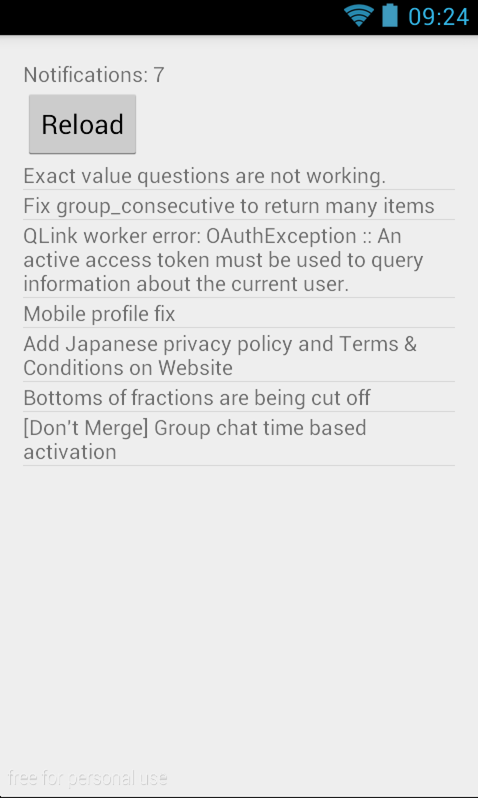

# Trying Kotlin + Rx + Anko

dagezi@{twitter, github, gmail.com}


## 自己紹介

- Java or C おじさん
- Quipperで Androidやってます
- インドネシア、フィリピン向け教育アプリ
- これから日本もまじめに挑戦します
- Resistance Agent L15


## 話そうと思ったこと

- Robospock いいぜ!
 - Groovyの文法よくわかんないけどすごいぜ
 - テストデータ作るの楽ちん
 - プロダクトコードじゃなきゃ動的言語もいいね!


## 話そうと思ったこと 2

- でもサンプルアプリ作るのだるいな
 - そういや前から Kotlinやってみたかったんだよな
 - Rxも、一級関数あれば簡単にできるし


## 話そうと思ったこと 3

- Kotlin + Rx でごまかしちゃえ
 - そんなに新しくないけどね
 - と思い立ったのが昨日でした





## 構成要素

- [github/dagezi/KotlinSample](https://github.com/dagezi/KotolinSample)
 - Kotlin
 - RxAndroid
 - Retrofit
 - Anko?


## Kotlin
- 名前が可愛い Alt Java 言語
- いろいろ Javaより使いやすい
 - NonNull, data class, lambda
- Jake神の推しメン


## RxAndroid
- Reactive eXtentionを Androidに適合
- Activityの寿命、threadなどをサポート
- Jake神が強力にサポート


## RxKotlin
- RxKotlin
 - いろいろ便利な関数がありそう
 - でも必須でもなさそう
 - 今回はパス


## Anko
- XMLとか使わなくても layout描ける!
- typesafe!
- inflaterないだけ速い (のか)?
- Jake神いまのところ傍観


## 辛い点: Annotationが互換性なさそう

- ActiveAndroid, Realmは使えないらしい
- Retrofit、GSON は使えてよかった


## 辛い点: Anko
ListAdapter と使う方法がよくわからない!

```
    java.lang.UnsupportedOperationException: addView(View)
            is not supported in AdapterView
            at android.widget.AdapterView.addView()
```

電池切れ。


## まとめ
- 割と楽しくおじさんでもアプリかけた
- 頑張ってまともなアプリにします!


## Wanted!


